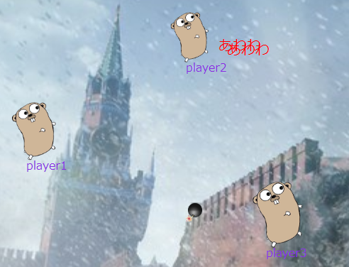
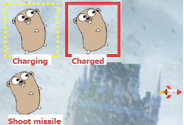

# gopher-war

Shooting game of gopher using websocket implemented by melody(https://github.com/olahol/melody) and gin(https://gin-gonic.github.io/gin/).

## Screenshot

## How to play

Move ... move cursor.  
Fire bomb ... click.  
Fire missile ... press right mouse button and hold on over 1.0sec(can be configured), then release the button.  

